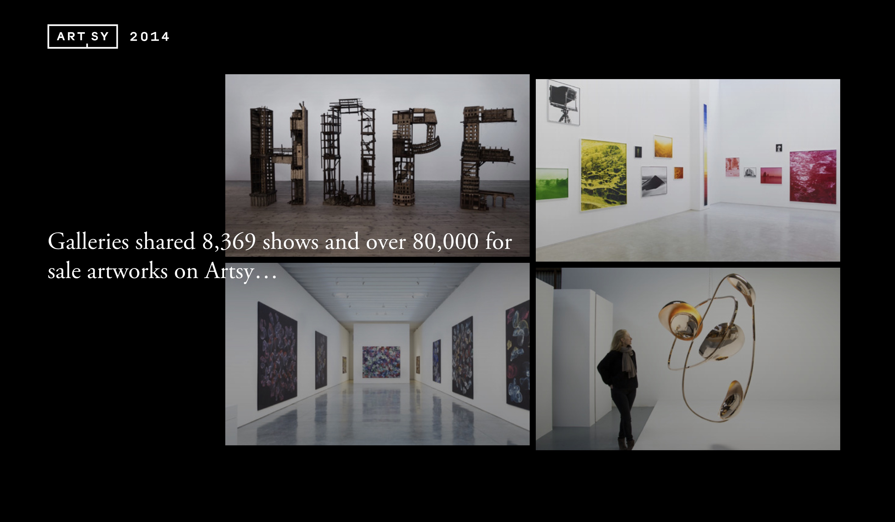

# 2014.ARTSY.NET

## About

__ARTSY.NET__
Artsy’s mission is to expand the art market to support more artists and art in the world.
We are a platform for collecting and discovering art.

__THE ART WORLD - ONLINE__
Artsy features the world’s leading galleries, museum collections, foundations, artist estates, art fairs, and benefit auctions, all in one place. Our growing database of 1,000,000 works of art, architecture, and design by 100,000 artists spans historical, modern, and contemporary works, and includes the largest online database of contemporary art. Artsy is used by art lovers, museum-goers, patrons, collectors, students, and educators to discover, learn about, and collect art.

__2014.ARTSY.NET__
Is a landing page that reflects the development of the website and exhibitions.

## Development

- Open your Terminal $ `npm i && gulp`
- Open new Terminal Tab/Window $ `npm start`

2014.ARTSY.NET use the following technologies:

- NodeJS
- Express
- Jade
- Gulp
- CoffeScript
- jQuery 

### License

CC BY-NC-SA 4.0
